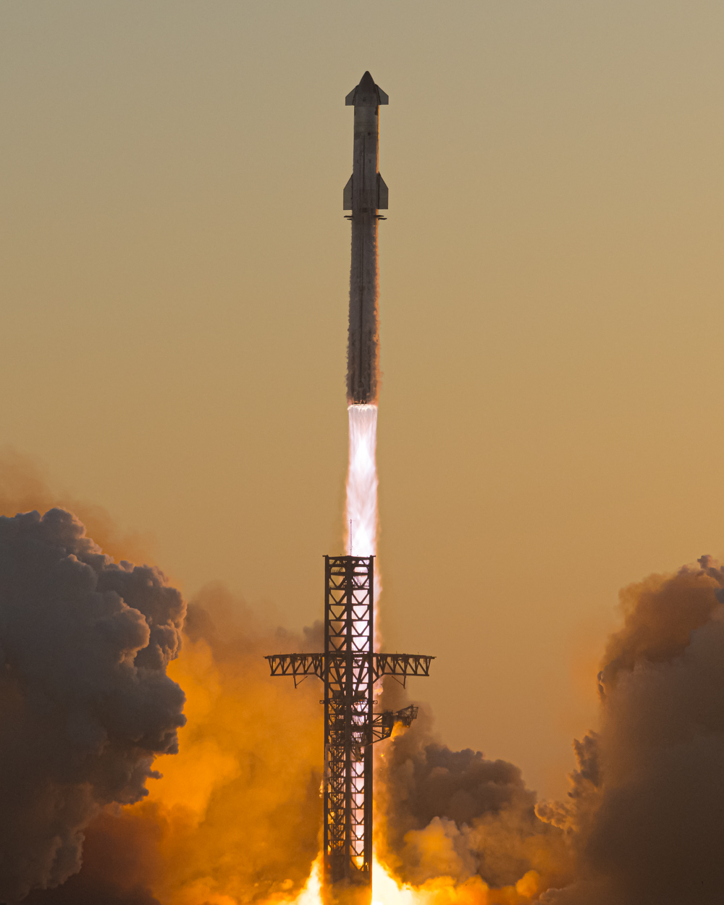

# Elon Musk 最新推文

*抓取时间: 2025/7/29 19:37:34*

---

## 推文 1

**用户:** John Kraus@johnkrausphotos·14h
**时间:** 14h
**发布时间:** 2025-07-29T00:58:51.000Z

**内容:**

**图片:**

---

## 推文 2

**用户:** Chamath Palihapitiya@chamath·3h
**时间:** 3h
**发布时间:** 2025-07-29T11:49:31.000Z

**内容:**

---

## 推文 3

**用户:** The Boring Company@boringcompany·17h
**时间:** 17h
**发布时间:** 2025-07-28T21:49:16.000Z

**内容:**
We are hiring the founding team for Music City Loop!

Looking for engineers, operations coordinators, electricians, welders and mechanics to grow our team in Nashville.

Hiring Event: 
Wednesday, July 30, 6:00pm - 8:00pm.

Apply to learn more about TBC, and meet the team.

---

## 推文 4

**用户:** The Boring Company@boringcompany·17h
**时间:** 17h
**发布时间:** 2025-07-28T21:45:41.000Z

**内容:**
Announcing Music City Loop!  The Boring Company is coming to the State of Tennessee. 

Las Vegas Loop has already moved more than 3M passengers, and growing.  Next stop, Nashville!

Thanks to the Tennessee Department of Transportation @myTDOT, Governor Bill Lee @GovBillLee, The

---

## 统计信息

- **推文总数:** 4
- **图片总数:** 1 (已下载到本地)
- **链接总数:** 0

### 下载的图片

**推文 1:**
- ./images/elon_tweet_1_image_1_2025-07-29T15-37-32-520Z.jpg

